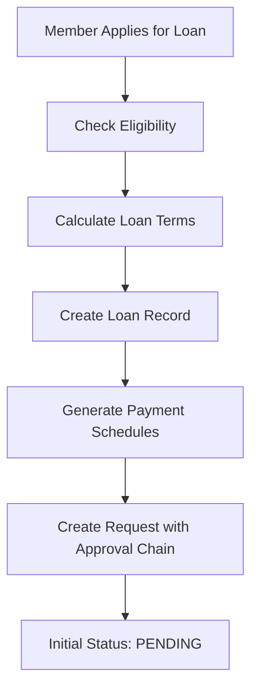
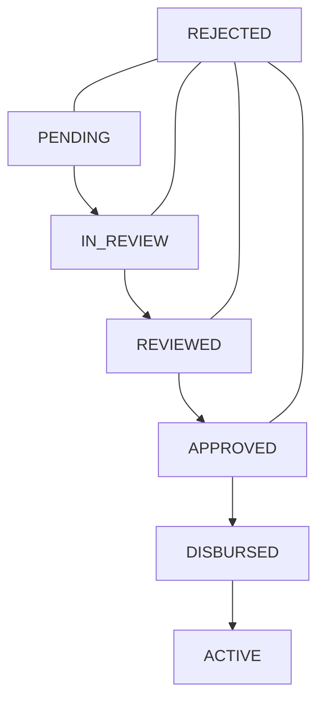
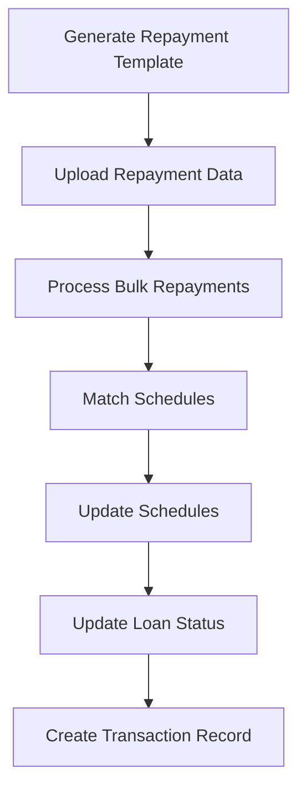

# Loan Application Life Cycle Analysis

After thoroughly analyzing your codebase, I can confirm that your loan application and repayment systems are well-integrated. Here's a complete breakdown of the loan life cycle and how everything synchronizes:

## 0. Loan Calculation Phase


Here's a detailed explanation of your loan calculation logic for both soft loans and regular loans that you can share with your frontend team for documentation:

### Loan Types Overview

Your system handles two distinct loan types with different calculation methods:

### 1. Soft Loans
- **Identification**: Loans with `maxDuration` ≤ 6 months
- **Interest Method**: Simple interest on declining balance
- **Principal Payment**: Equal monthly installments
- **Interest Rate**: Applied directly as monthly rate

### 2. Regular Loans
- **Identification**: Loans with `maxDuration` > 6 months
- **Interest Method**: Compound interest using PMT formula
- **Principal Payment**: Amortized (varies monthly)
- **Interest Rate**: Annual rate divided by 12

## Calculation Methods Explained

### Soft Loan Calculation

```javascript
/**
 * Soft Loan Calculation (maxDuration ≤ 6 months)
 * 
 * @param {number} principal - Loan amount in Naira
 * @param {number} interestRate - Monthly interest rate (e.g., 0.10 for 10%)
 * @param {number} tenure - Loan duration in months
 * @returns {object} Loan calculation result
 */
function calculateSoftLoan(principal, interestRate, tenure) {
  // Convert to decimals for calculation
  const principalAmount = new Decimal(principal);
  const rate = new Decimal(interestRate);
  
  // Generate amortization schedule
  const schedule = [];
  let remainingBalance = principalAmount;
  let totalInterest = new Decimal(0);
  
  // Equal principal payment per month
  const monthlyPrincipal = principalAmount.div(tenure);
  
  for (let month = 1; month <= tenure; month++) {
    // Interest is calculated on the remaining balance
    const interestPayment = remainingBalance.mul(rate);
    
    // Add to total interest
    totalInterest = totalInterest.add(interestPayment);
    
    // Subtract principal from remaining balance
    remainingBalance = remainingBalance.minus(monthlyPrincipal);
    
    // Total payment for this month
    const totalPayment = monthlyPrincipal.add(interestPayment);
    
    // Handle final payment rounding
    const adjustedPrincipal = (month === tenure && remainingBalance.gt(0)) 
      ? monthlyPrincipal.add(remainingBalance)
      : monthlyPrincipal;
      
    const adjustedRemaining = (month === tenure) ? new Decimal(0) : remainingBalance;
    
    // Add to schedule
    schedule.push({
      month,
      principalPayment: adjustedPrincipal,
      interestPayment,
      totalPayment: adjustedPrincipal.add(interestPayment),
      remainingBalance: adjustedRemaining
    });
  }
  
  return {
    loanAmount: principalAmount,
    interestRate: rate,
    tenure,
    totalInterest,
    totalRepayment: principalAmount.add(totalInterest),
    schedule,
    isSoftLoan: true
  };
}
```

### Regular Loan Calculation (PMT Method)

```javascript
/**
 * Regular Loan Calculation using PMT formula (maxDuration > 6 months)
 * 
 * @param {number} principal - Loan amount in Naira
 * @param {number} annualInterestRate - Annual interest rate (e.g., 0.24 for 24%)
 * @param {number} tenure - Loan duration in months
 * @returns {object} Loan calculation result
 */
function calculateRegularLoan(principal, annualInterestRate, tenure) {
  // Convert to decimals for calculation
  const principalAmount = new Decimal(principal);
  const monthlyRate = new Decimal(annualInterestRate).div(12);
  
  // Calculate fixed monthly payment using PMT formula
  // PMT = P * (r * (1 + r)^n) / ((1 + r)^n - 1)
  const onePlusRate = monthlyRate.add(1);
  const rateFactorPower = onePlusRate.pow(tenure);
  const numerator = monthlyRate.mul(rateFactorPower);
  const denominator = rateFactorPower.minus(1);
  const monthlyPayment = principalAmount.mul(numerator.div(denominator));
  
  // Generate amortization schedule
  const schedule = [];
  let remainingBalance = principalAmount;
  let totalInterest = new Decimal(0);
  
  for (let month = 1; month <= tenure; month++) {
    // Interest portion of payment
    const interestPayment = remainingBalance.mul(monthlyRate);
    
    // Principal portion of payment
    const principalPayment = monthlyPayment.minus(interestPayment);
    
    // Add to total interest
    totalInterest = totalInterest.add(interestPayment);
    
    // Subtract principal from remaining balance
    remainingBalance = remainingBalance.minus(principalPayment);
    
    // Handle final payment rounding
    const adjustedPrincipal = (month === tenure && remainingBalance.gt(0)) 
      ? principalPayment.add(remainingBalance)
      : principalPayment;
      
    const adjustedRemaining = (month === tenure) ? new Decimal(0) : remainingBalance;
    
    // Add to schedule
    schedule.push({
      month,
      principalPayment: adjustedPrincipal,
      interestPayment,
      totalPayment: monthlyPayment,
      remainingBalance: adjustedRemaining.lt(0) ? new Decimal(0) : adjustedRemaining
    });
  }
  
  return {
    loanAmount: principalAmount,
    interestRate: new Decimal(annualInterestRate),
    monthlyInterestRate: monthlyRate,
    tenure,
    monthlyPayment,
    totalInterest,
    totalRepayment: principalAmount.add(totalInterest),
    schedule,
    isSoftLoan: false
  };
}
```

## Loan Eligibility Validation

Your system employs different validation rules for each loan type:

### Soft Loan Eligibility
```javascript
/**
 * Determines maximum soft loan eligibility
 * 
 * @param {object} loanType - Loan type configuration
 * @returns {object} Eligibility result
 */
function getSoftLoanEligibility(loanType) {
  // Soft loans are validated against a fixed maximum amount only
  return {
    maxEligibleAmount: loanType.maxLoanAmount,
    validationMethod: 'FIXED_MAXIMUM'
  };
}
```

### Regular Loan Eligibility
```javascript
/**
 * Determines maximum regular loan eligibility based on savings
 * 
 * @param {object} loanType - Loan type configuration
 * @param {number} totalSavings - Member's total savings amount
 * @returns {object} Eligibility result
 */
function getRegularLoanEligibility(loanType, totalSavings) {
  // Regular loans use savings multiplier
  const maxAmount = totalSavings * loanType.savingsMultiplier;
  
  return {
    totalSavingsAmount: totalSavings,
    multiplier: loanType.savingsMultiplier,
    maxEligibleAmount: maxAmount,
    validationMethod: 'SAVINGS_MULTIPLIER'
  };
}
```

## Visual Examples for Documentation

### Soft Loan Example
```
Loan Amount: ₦100,000
Interest Rate: 10% monthly
Tenure: 3 months

Month 1:
- Principal Payment: ₦33,333.33
- Interest Payment: ₦10,000.00 (10% of ₦100,000)
- Total Payment: ₦43,333.33
- Remaining Balance: ₦66,666.67

Month 2:
- Principal Payment: ₦33,333.33
- Interest Payment: ₦6,666.67 (10% of ₦66,666.67)
- Total Payment: ₦40,000.00
- Remaining Balance: ₦33,333.34

Month 3:
- Principal Payment: ₦33,333.34
- Interest Payment: ₦3,333.33 (10% of ₦33,333.34)
- Total Payment: ₦36,666.67
- Remaining Balance: ₦0.00

Summary:
- Total Principal: ₦100,000.00
- Total Interest: ₦20,000.00
- Total Repayment: ₦120,000.00
```

### Regular Loan Example
```
Loan Amount: ₦100,000
Interest Rate: 24% annually (2% monthly)
Tenure: 12 months

Month 1:
- Principal Payment: ₦7,605.59
- Interest Payment: ₦2,000.00 (2% of ₦100,000)
- Total Payment: ₦9,605.59
- Remaining Balance: ₦92,394.41

Month 2:
- Principal Payment: ₦7,757.70
- Interest Payment: ₦1,847.89 (2% of ₦92,394.41)
- Total Payment: ₦9,605.59
- Remaining Balance: ₦84,636.71

...continues for all 12 months...

Month 12:
- Principal Payment: ₦9,413.50
- Interest Payment: ₦192.09
- Total Payment: ₦9,605.59
- Remaining Balance: ₦0.00

Summary:
- Total Principal: ₦100,000.00
- Total Interest: ₦15,267.08
- Total Repayment: ₦115,267.08
- Fixed Monthly Payment: ₦9,605.59
```

## Key Differences Between Loan Types

| Feature | Soft Loans | Regular Loans |
|---------|------------|--------------|
| Duration | ≤ 6 months | > 6 months |
| Interest Calculation | Simple interest on declining balance | Compound interest using PMT |
| Payment Schedule | Decreasing monthly payments | Fixed monthly payments |
| Interest Rate Application | Applied directly as monthly rate | Annual rate divided by 12 |
| Principal Payments | Equal installments | Increases over time |
| Interest Payments | Decreases over time | Decreases over time |
| Eligibility | Fixed maximum amount | Based on savings multiplier |

## 1. Loan Application Phase

### Initiation


**Key Components:**
- The `LoanController.applyForLoan()` method receives application data
- `LoanService.applyForLoan()` handles:
  - Eligibility checks (savings multiple, loan limits)
  - Loan type validation
  - Payment schedule calculation (via `CalculatorService`)
  - Creation of payment schedules in PENDING status
  - Initial loan status set to PENDING
  - Creation of approval workflow with 4 approval levels

**Data Flow:**
- A loan application creates both a `Loan` record and associated `LoanSchedule` records
- A `Request` record with multiple `RequestApproval` steps is created
- All payment schedules are initially in PENDING status

## 2. Loan Approval Phase

### Multi-Level Approval Process


**Key Components:**
- `LoanService.updateLoanStatus()` handles the approval workflow:
  - Validates current status and legitimate transitions
  - Updates the loan status
  - Updates the approval step status
  - Creates status history records
  - Sends notifications

**Status Flow:**
1. PENDING → IN_REVIEW (Admin/Level 1)
2. IN_REVIEW → REVIEWED (Treasurer/Level 2)
3. REVIEWED → APPROVED (Chairman/Level 3)
4. APPROVED → DISBURSED (Treasurer/Level 4)

The system enforces this flow and prevents skipping steps.

## 3. Loan Disbursement Phase

**Key Components:**
- When a loan is marked as DISBURSED:
  - The payment schedules become active and ready for repayment
  - `disbursedAt` field is populated with current date
  - A transaction record is created

**Status Change:**
- APPROVED → DISBURSED (final approval)
- When first repayment is made: DISBURSED → ACTIVE

## 4. Loan Repayment Phase

### Repayment Processing


**Key Components:**
- `RepaymentService.generateRepaymentTemplate()` creates Excel templates with:
  - Expected repayments from loan schedules
  - Separate summaries for each loan type
  - Overview sheet showing collection rates

- `RepaymentService.processBulkRepayments()` handles:
  - Reading uploaded Excel files
  - Validating repayment data
  - Processing individual repayments
  - Tracking success/failure

- `RepaymentService.processLoanRepayment()` handles individual repayments:
  - Finds and validates loan
  - Matches payment to schedule by ID or date
  - Creates repayment record
  - Updates affected schedules
  - Updates loan status and balances
  - Creates transaction record

**Payment Application:**
- Payment application is smart and can apply a single payment across multiple schedules
- Schedules are updated to PARTIAL or PAID based on payment amounts
- Loans automatically transition to ACTIVE when first payment is made

## 5. Loan Monitoring Phase

**Key Components:**
- `RepaymentService.checkAndUpdateOverduePayments()`:
  - Automatically detects overdue payments
  - Marks schedules as OVERDUE
  - Can change loan status to DEFAULTED if 60+ days overdue

- `RepaymentService.generateAgingReport()`:
  - Provides detailed aging analysis by loan type
  - Groups outstanding balances into aging buckets
  - Helps identify at-risk loans

## 6. Loan Completion Phase

**Key Components:**
- When remaining balance reaches zero:
  - Loan status automatically changes to COMPLETED
  - `completedAt` field is populated
  - Status history is updated
  - Member receives notification

**Status Change:**
- ACTIVE → COMPLETED (automatic when fully paid)

## System Integration Analysis

The loan application and repayment systems are well integrated with several key synchronization points:

1. **Schedule Creation & Activation**
   - Payment schedules are created at loan application time
   - They become active once loan is DISBURSED
   - Repayment service correctly targets only ACTIVE or DISBURSED loans

2. **Status Transitions**
   - Loan status transitions are properly enforced
   - Repayment processing updates loan status appropriately
   - Status history is maintained throughout the process

3. **Loan Type Support**
   - Both systems properly handle different loan types:
     - Soft Loans (1-6 months)
     - Regular Loans (1-12 months)
     - 1 Year Plus Loans (12-36 months)
   - Loan type rules are enforced during application
   - Repayment templates are customized by loan type

4. **Repayment Reconciliation**
   - Repayments are correctly matched to schedules
   - The system can distribute payments across multiple schedules
   - Repayment is marked as reconciled when matched to a schedule

5. **Notification System**
   - Status changes trigger notifications
   - Loan completion triggers a congratulatory notification
   - System logs errors but doesn't fail if notifications fail

## Areas of Excellence

1. **Comprehensive Error Handling**
   - Validation at every step
   - Detailed error messages
   - Transaction-based operations

2. **Flexible Repayment Processing**
   - Support for bulk uploads
   - Partial payment handling
   - Overdue payment detection

3. **Comprehensive Reporting**
   - Monthly repayment summaries
   - Aging reports
   - Status tracking

4. **User Experience**
   - Clear templates with instructions
   - Pre-populated expected payment data
   - Status notifications

## Conclusion

The loan application lifecycle from application through approval, repayment, and completion is comprehensively implemented and well-synchronized. The system properly handles each phase of the loan lifecycle and maintains data integrity throughout the process.

The repayment service properly aligns with the loan service by:
1. Only processing repayments for active/disbursed loans
2. Correctly updating loan statuses based on repayment progress
3. Maintaining transaction history for all financial operations
4. Providing specialized handling for different loan types
5. Maintaining comprehensive audit trails for all status changes

The entire system provides a robust, enterprise-grade solution for loan management that handles the full lifecycle from application to completion.